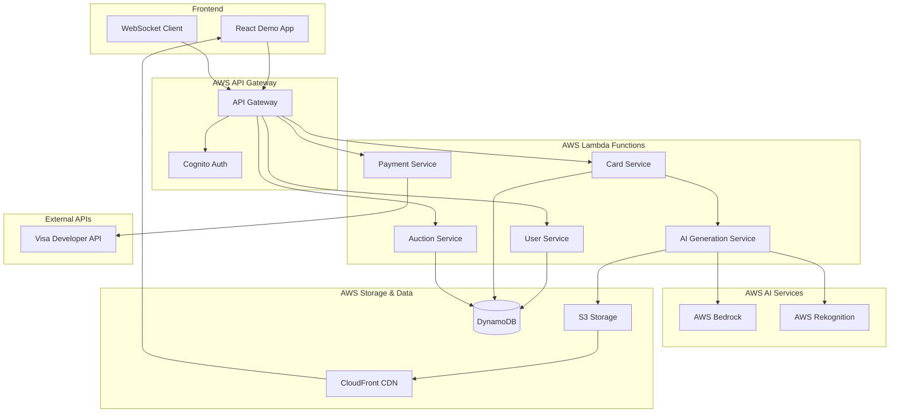

# Design Document

## Overview

The AI Trading Cards platform is a web-based application that transforms user-uploaded images into collectible digital trading cards through AI generation. The system consists of a React frontend, AWS serverless backend, AI generation services, and a time-limited auction system. The architecture focuses on core functionality: image processing, AI card generation, and auction-based trading with real-time bidding updates.

## Architecture

### High-Level Architecture



### Technology Stack

**Frontend:**
- React 18 with TypeScript for rapid development
- Tailwind CSS for quick styling
- React Query for state management
- WebSocket client for real-time auction updates
- Vite for fast development and building

**Backend:**
- Node.js with Express.js framework
- AWS Lambda for serverless functions
- AWS API Gateway for REST endpoints
- Socket.io for real-time bidding

**AWS Infrastructure:**
- **AWS Bedrock**: AI image generation from video frames
- **AWS S3**: Video and image storage
- **AWS DynamoDB**: Fast NoSQL database for auction data
- **AWS CloudFront**: CDN for media delivery
- **AWS Cognito**: User authentication

**Payment Integration:**
- **Visa Developer Sandbox**: Payment processing for auction settlements
- **Visa Direct**: Real-time money transfers for winners

**AI Integration:**
- AWS Bedrock (Claude/Stable Diffusion) for card art generation
- AWS Rekognition for video frame extraction
- Custom prompts for trading card aesthetics

## Components and Interfaces

### Core Data Models

#### User Model
```typescript
interface User {
  id: string;
  username: string;
  email: string;
  balance: number;
  createdAt: Date;
  updatedAt: Date;
  profile: {
    avatar?: string;
    bio?: string;
    badges: Badge[];
  };
  stats: {
    cardsCreated: number;
    cardsOwned: number;
    totalEarnings: number;
    totalSpent: number;
  };
}
```

#### Card Model
```typescript
interface Card {
  id: string;
  name: string;
  description: string;
  cardImageUrl: string; // AI-generated trading card
  originalImageUrl: string; // User's original image
  rarity: 'Common' | 'Rare' | 'Epic' | 'Legendary';
  creatorId: string;
  currentOwnerId: string;
  createdAt: Date;
  isInAuction: boolean;
}
```

#### Auction Model
```typescript
interface Auction {
  id: string;
  cardId: string;
  sellerId: string;
  startingBid: number;
  currentBid: number;
  currentBidderId?: string;
  startTime: Date;
  endTime: Date;
  status: 'active' | 'completed' | 'cancelled';
  bids: Bid[];
  paymentStatus?: 'pending' | 'processing' | 'completed' | 'failed';
  visaTransactionId?: string;
}

interface Bid {
  id: string;
  auctionId: string;
  bidderId: string;
  amount: number;
  timestamp: Date;
  paymentMethodId?: string; // Visa payment method
}
```

### Service Interfaces

#### AI Generation Service
```typescript
interface AIGenerationService {
  generateCardFromImage(image: File, userId: string): Promise<GeneratedCard>;
  analyzeImage(imageUrl: string): Promise<ImageAnalysis>; // AWS Rekognition
  generateCardArt(imageUrl: string, prompt: string): Promise<string>; // AWS Bedrock
  generateCardMetadata(imageAnalysis: ImageAnalysis): Promise<CardMetadata>;
  determineRarity(): CardRarity;
}
```

#### Auction Service
```typescript
interface AuctionService {
  createAuction(cardId: string, startingBid: number, duration: number, sellerId: string): Promise<Auction>;
  placeBid(auctionId: string, amount: number, bidderId: string, paymentMethodId: string): Promise<Bid>;
  getActiveAuctions(): Promise<Auction[]>;
  endAuction(auctionId: string): Promise<void>;
  processPayment(auctionId: string): Promise<PaymentResult>;
}
```

#### Payment Service
```typescript
interface PaymentService {
  processAuctionPayment(amount: number, winnerId: string, sellerId: string): Promise<PaymentResult>;
  createPaymentMethod(userId: string, cardDetails: any): Promise<string>;
  validatePaymentMethod(paymentMethodId: string): Promise<boolean>;
  transferFunds(fromAccount: string, toAccount: string, amount: number): Promise<TransferResult>;
}
```

### Frontend Components Architecture

#### Page Components
- **HomePage**: Landing page with active auctions
- **CreateCardPage**: Image upload interface and AI generation flow
- **AuctionsPage**: Browse active auctions with real-time bidding
- **CardDetailPage**: Individual card view with auction details
- **ProfilePage**: User collection and auction history

#### Shared Components
- **CardComponent**: Reusable card display with rarity styling
- **AuctionTimer**: Real-time countdown for auction end time
- **BidModal**: Bidding interface with validation
- **ImageUpload**: Image upload with drag-and-drop and validation
- **LoadingSpinner**: AI generation progress indicator

## Data Models

### DynamoDB Schema

#### Users Table
```json
{
  "TableName": "Users",
  "KeySchema": [
    { "AttributeName": "userId", "KeyType": "HASH" }
  ],
  "AttributeDefinitions": [
    { "AttributeName": "userId", "AttributeType": "S" },
    { "AttributeName": "email", "AttributeType": "S" }
  ],
  "GlobalSecondaryIndexes": [
    {
      "IndexName": "EmailIndex",
      "KeySchema": [{ "AttributeName": "email", "KeyType": "HASH" }]
    }
  ]
}

// User Item Structure
{
  "userId": "user-123",
  "username": "john_doe",
  "email": "john@example.com",
  "cognitoId": "cognito-user-id",
  "balance": 1000.00,
  "paymentMethods": ["visa-pm-123"],
  "createdAt": "2024-01-01T00:00:00Z"
}
```

#### Cards Table
```json
{
  "TableName": "Cards",
  "KeySchema": [
    { "AttributeName": "cardId", "KeyType": "HASH" }
  ],
  "AttributeDefinitions": [
    { "AttributeName": "cardId", "AttributeType": "S" },
    { "AttributeName": "creatorId", "AttributeType": "S" },
    { "AttributeName": "currentOwnerId", "AttributeType": "S" }
  ],
  "GlobalSecondaryIndexes": [
    {
      "IndexName": "CreatorIndex",
      "KeySchema": [{ "AttributeName": "creatorId", "KeyType": "HASH" }]
    },
    {
      "IndexName": "OwnerIndex", 
      "KeySchema": [{ "AttributeName": "currentOwnerId", "KeyType": "HASH" }]
    }
  ]
}

// Card Item Structure
{
  "cardId": "card-123",
  "name": "Epic Dragon Card",
  "description": "A majestic dragon soaring through clouds",
  "cardImageUrl": "https://cdn.example.com/cards/card-123.jpg",
  "originalImageUrl": "https://s3.amazonaws.com/images/original-123.jpg",
  "rarity": "Epic",
  "creatorId": "user-123",
  "currentOwnerId": "user-456",
  "isInAuction": false,
  "createdAt": "2024-01-01T00:00:00Z"
}
```

#### Auctions Table
```json
{
  "TableName": "Auctions",
  "KeySchema": [
    { "AttributeName": "auctionId", "KeyType": "HASH" }
  ],
  "AttributeDefinitions": [
    { "AttributeName": "auctionId", "AttributeType": "S" },
    { "AttributeName": "status", "AttributeType": "S" },
    { "AttributeName": "endTime", "AttributeType": "S" }
  ],
  "GlobalSecondaryIndexes": [
    {
      "IndexName": "StatusIndex",
      "KeySchema": [
        { "AttributeName": "status", "KeyType": "HASH" },
        { "AttributeName": "endTime", "KeyType": "RANGE" }
      ]
    }
  ]
}

// Auction Item Structure
{
  "auctionId": "auction-123",
  "cardId": "card-123",
  "sellerId": "user-123",
  "startingBid": 50.00,
  "currentBid": 75.00,
  "currentBidderId": "user-456",
  "startTime": "2024-01-01T00:00:00Z",
  "endTime": "2024-01-01T01:00:00Z",
  "status": "active",
  "bids": [
    {
      "bidId": "bid-123",
      "bidderId": "user-456", 
      "amount": 75.00,
      "timestamp": "2024-01-01T00:30:00Z",
      "paymentMethodId": "visa-pm-456"
    }
  ],
  "paymentStatus": "pending",
  "visaTransactionId": null
}
```

### Caching Strategy

#### AWS Services Integration

**AWS Bedrock Integration:**
- Model: Stable Diffusion XL for card art generation
- Custom prompts for trading card aesthetics
- Frame-to-art transformation pipeline

**AWS Rekognition Integration:**
- Image content analysis and object detection
- Content moderation for uploaded images
- Scene and object analysis for card metadata generation

**Visa Developer API Integration:**
- Sandbox environment for demo payments
- Payment method tokenization
- Real-time fund transfers via Visa Direct
- Transaction monitoring and webhooks

**DynamoDB Streams:**
- Real-time auction updates
- Automatic bid notifications
- Payment status changes

## Error Handling

### API Error Responses
```typescript
interface APIError {
  code: string;
  message: string;
  details?: any;
  timestamp: Date;
}
```

### Error Categories
- **Validation Errors**: Invalid input data, file format issues
- **Authentication Errors**: Invalid tokens, unauthorized access
- **Business Logic Errors**: Insufficient balance, card not available
- **External Service Errors**: AI generation failures, content moderation issues
- **System Errors**: Database connection issues, file storage problems

### Error Handling Strategy
- Client-side validation with immediate feedback
- Server-side validation with detailed error messages
- Graceful degradation for AI service failures
- Retry mechanisms for transient failures
- User-friendly error messages with actionable guidance

## Testing Strategy

### Unit Testing
- **Service Layer**: Test business logic in isolation
- **API Endpoints**: Test request/response handling
- **Utility Functions**: Test helper functions and validators
- **Database Operations**: Test CRUD operations with test database

### Integration Testing
- **AI Generation Flow**: Test complete card creation process
- **Transaction Processing**: Test marketplace purchase flow
- **Authentication Flow**: Test user registration and login
- **File Upload**: Test media processing pipeline

### End-to-End Testing
- **User Journey**: Complete card creation to marketplace sale
- **Marketplace Browsing**: Search, filter, and purchase flows
- **Profile Management**: Collection viewing and transaction history
- **Social Features**: Card liking and sharing functionality

### Performance Testing
- **Load Testing**: Concurrent user scenarios
- **AI Generation**: Response time under load
- **Database Queries**: Query optimization validation
- **File Upload**: Large file handling performance

### Testing Tools
- **Jest**: Unit and integration testing
- **Supertest**: API endpoint testing
- **Playwright**: End-to-end browser testing
- **Artillery**: Load testing for performance validation

## Security Considerations

### Authentication & Authorization
- JWT tokens with refresh mechanism
- Role-based access control for admin functions
- Rate limiting on sensitive endpoints
- Session management with Redis

### Data Protection
- Input validation and sanitization
- SQL injection prevention with parameterized queries
- XSS protection with content security policies
- File upload validation and virus scanning

### Content Security
- Content moderation API integration
- User reporting system for inappropriate content
- Automated content filtering rules
- Manual review queue for flagged content

### Financial Security
- Transaction atomicity with database transactions
- Balance validation before purchases
- Audit trail for all financial operations
- Fraud detection for suspicious patterns

## Performance Optimization

### Frontend Optimization
- Code splitting for faster initial load
- Image lazy loading and optimization
- React Query for efficient data fetching
- WebSocket for real-time updates

### Backend Optimization
- Database indexing on frequently queried fields
- Redis caching for expensive operations
- Connection pooling for database efficiency
- Async processing for AI generation

### Scalability Considerations
- Horizontal scaling with load balancers
- Database read replicas for query distribution
- CDN for static asset delivery
- Queue system for background processing

## Hackathon Demo Requirements

### Demo Flow
1. **User Registration**: Quick signup with Cognito
2. **Image Upload**: Upload an image (drag-and-drop interface)
3. **AI Generation**: Watch real-time card creation with AWS Bedrock
4. **Auction Creation**: Set starting bid and duration (5-15 minutes for demo)
5. **Live Bidding**: Multiple users can bid in real-time
6. **Payment Processing**: Winner pays via Visa sandbox
7. **Card Transfer**: Ownership automatically transfers to winner

### Demo Data
- Pre-seeded demo users with Visa sandbox payment methods
- Sample images for quick card generation
- Active auctions with different time remaining
- Real-time bidding simulation

### Technical Demo Features
- **Live AI Generation**: Show Bedrock creating card art from images
- **Real-time Auctions**: WebSocket updates for live bidding
- **Payment Integration**: Actual Visa API calls (sandbox)
- **AWS Services**: Demonstrate S3, DynamoDB, Bedrock, Rekognition integration
- **Responsive UI**: Works on mobile and desktop for judges

## Deployment Architecture

### AWS Serverless Stack
- **Frontend**: S3 + CloudFront for static hosting
- **Backend**: Lambda functions with API Gateway
- **Database**: DynamoDB for scalability
- **Storage**: S3 for images and generated cards
- **AI**: Bedrock for card generation
- **Auth**: Cognito for user management
- **Payments**: Visa Developer API integration

### Development Environment
- Local development with AWS SAM
- Mock Visa API for local testing
- Hot reloading with Vite
- AWS LocalStack for service simulation

### Demo Environment
- Fully deployed AWS stack
- Visa sandbox integration
- Real-time monitoring dashboard
- Demo data pre-loaded